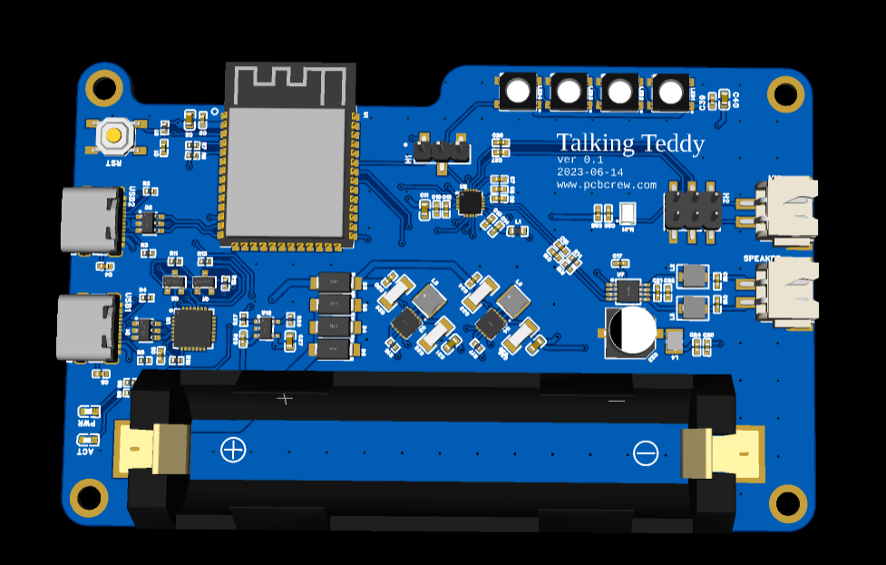
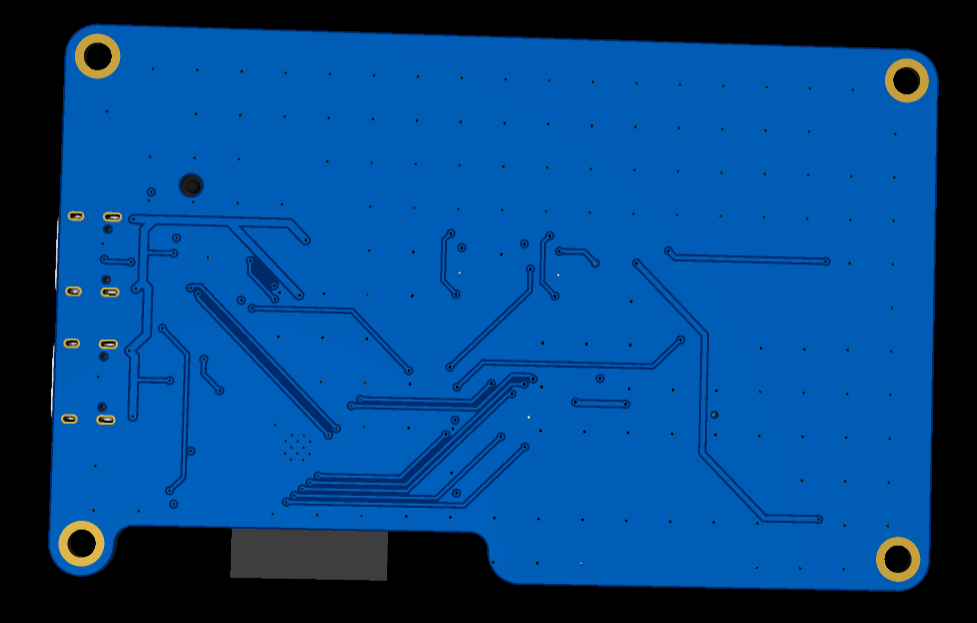

# [PCBCrew ™][pcbcrew] Talking Teddy

> * Designed for `@ank`
> * Designed by [PCBCrew ™][pcbcrew]

ESP32 audio processing board for Speech-to-Text and Text-to-Speech applications.
* ESP32-S3
* ES8311 mono audio codec
* NS4150 3W amplifier
* optional on-board microphone
* RGB LEDs
* 1s Li-ion/Li-Po battery holder and BMS

| 3D Preview (top)                                       | 3D Preview (bottom)                                      |
| ------------------------------------------------------ | -------------------------------------------------------- |
|  |  |

## Project Ownership

This repository is hosted on [PCBCrew Org](https://github.com/pcbcrew-org) for backup.
The copyright of this hardware design is owned by `@ank`.

---

[pcbcrew]: https://pcbcrew.com
